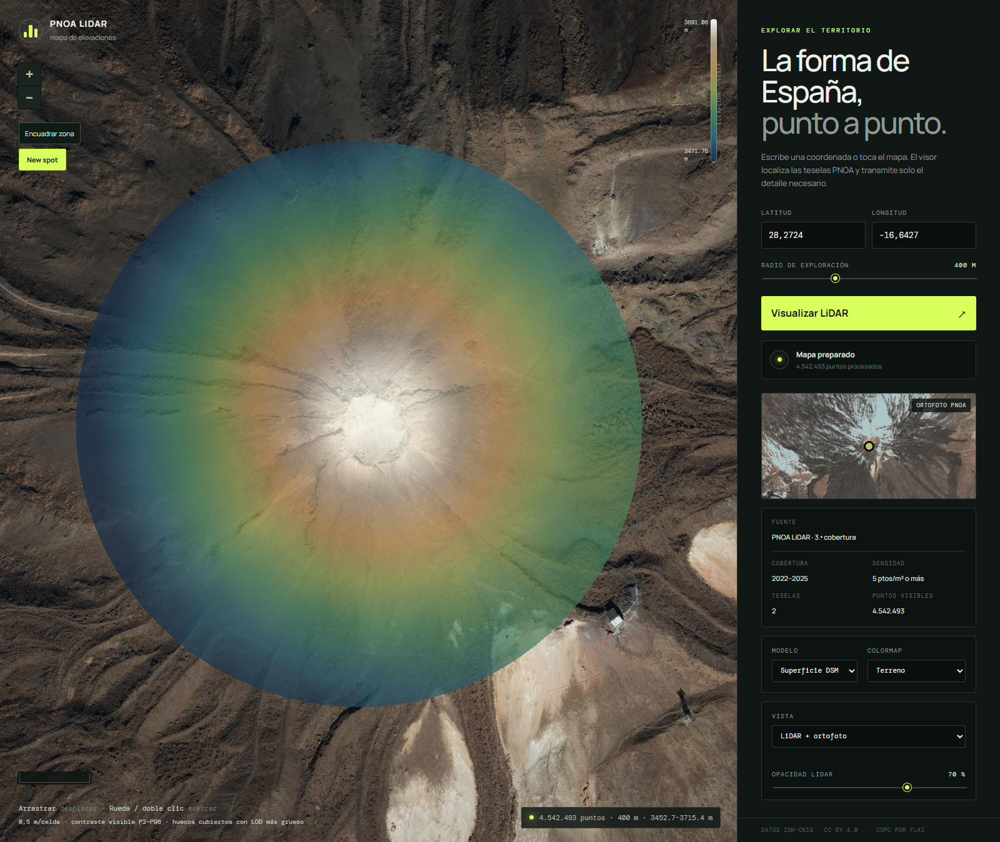

# PNOA Explorer

Visor web cenital de las nubes de puntos LiDAR del Plan Nacional de Ortofotografía Aérea. Recibe una coordenada WGS84 y un radio, localiza las teselas que la rodean y genera un mapa de profundidad/elevación con los nodos COPC necesarios.



## Ejecutar

Requiere Node.js 20 o posterior.

```powershell
npm install
npm run dev
```

Abre `http://127.0.0.1:5173`. La primera búsqueda en cada huso descarga el índice público y lo guarda en IndexedDB; las siguientes consultas lo reutilizan.

## Ejecutable para Windows

Para generar un único servidor portable de Windows:

```powershell
npm run release:win
npm run test:release
```

Los artefactos quedan en `release/`: el ejecutable `PNOAExplorer-v<versión>-win-x64.exe` y `SHA256SUMS.txt`. El usuario solo necesita ejecutar el `.exe`, mantener abierta la consola y visitar `http://127.0.0.1:4173`. No necesita Node.js ni Bun instalados. Se puede elegir otro puerto con `--port 8080`.

## Funciones actuales

- Selección por latitud, longitud o clic sobre la ortofoto PNOA.
- Selección automática de ETRS89/UTM 29, 30 y 31; REGCAN95/UTM 28 en Canarias.
- Localización exacta de teselas mediante sus cabeceras COPC.
- Peticiones HTTP parciales: se leen los nodos que intersectan el radio, no el fichero completo.
- Mapa cenital 2D con arrastre, zoom centrado en el cursor, doble clic y escala métrica.
- Capas conmutables LiDAR, ortofoto PNOA y vista combinada con opacidad LiDAR. Ambas capas comparten la proyección UTM y conservan posición y zoom al alternar.
- Botón «New spot»: usa el centro actual del mapa como nueva coordenada y carga el LiDAR del radio seleccionado. Permite navegar primero con la ortofoto y solicitar después una zona nueva.
- Pirámide LOD de elevaciones calculada en un worker, con celdas base de 0,5 m. El tamaño de celda no implica esa densidad de puntos en el vuelo.
- Las celdas vacías toman el valor del primer nivel más grueso con datos: sin suavizado ni interpolación, y sin sustituir las celdas finas ocupadas. El relleno se limita al círculo consultado y representa datos agregados, no nuevas mediciones.
- Contraste P2–P98 de los valores visibles, incluido el relleno, recalculado al navegar.
- Modelo de superficie DSM o terreno filtrado por la clase 2 LiDAR.
- Colormaps Terreno, Viridis, Turbo, escala de grises y tres variantes Detail: local P2–P98 recalculado al navegar, global para toda la descarga y manual con mínimo y máximo en metros. Las alturas fuera del intervalo se saturan a los colores extremos.
- Conservación de todos los puntos descargados; límite preventivo de 30 millones por consulta.
- El LOD funciona dentro del radio descargado. Para explorar otra zona, se realiza otra consulta.
- Catálogo persistente en el navegador.

## Datos

Los puntos proceden de PNOA LiDAR, IGN–CNIG, bajo CC BY 4.0. El MVP usa la copia en COPC publicada por [Flai Open LiDAR Data](https://github.com/flai-ai/open-lidar-data); el contenido de los puntos se mantiene y el formato permite lecturas parciales por HTTP. El mapa de contexto usa el WMS oficial PNOA Máxima Actualidad.

La Península y Baleares usan actualmente la segunda cobertura (2015–2021) de la réplica. Canarias usa la tercera (2022–2025). La siguiente integración prevista es añadir el catálogo oficial de la tercera cobertura del CNIG conforme se publique un mecanismo estable de consulta automática.

## Verificación

```powershell
npm test
npm run build
npm run test:smoke
npm run test:navigation
```

La prueba de navegador abre la coordenada `28.2724, -16.6427`, en el entorno del Teide, usando la tercera cobertura PNOA-LiDAR de Canarias. Resuelve las teselas reales, decodifica los nodos LAZ y guarda capturas en `artifacts/`.

## Licencia

El código se publica bajo [PolyForm Noncommercial 1.0.0](LICENSE): se permite el uso, modificación y distribución para fines no comerciales. Cualquier uso comercial requiere obtener previamente una licencia separada contactando con [Montyro](https://github.com/Montyro). Los datos LiDAR y la ortofoto mantienen sus licencias y atribuciones propias, indicadas en la interfaz.
